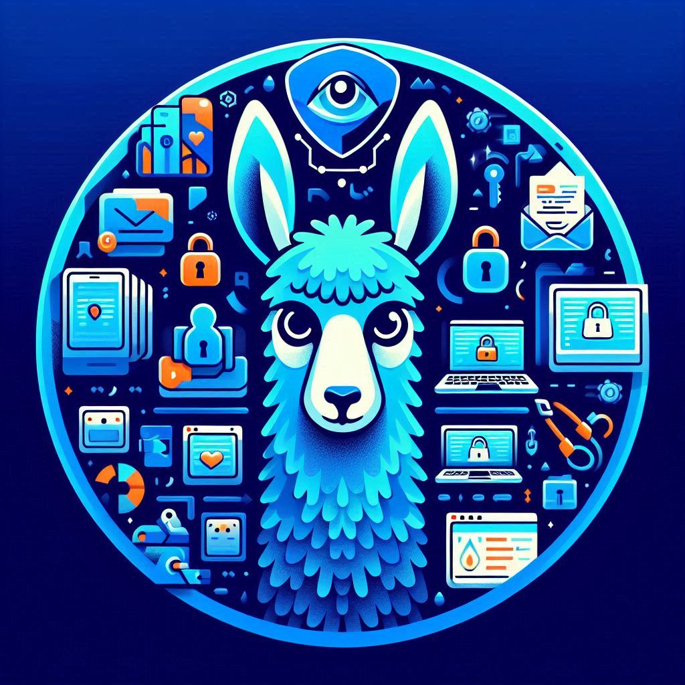

# Anti-Phishing Detection Tool 🛡️✨


## Table of Contents

- [📖 Introduction](#-introduction)
- [🔍 Features](#-features)
- [🛠️ Technologies Used](#️-technologies-used)
- [📋 Prerequisites](#-prerequisites)
- [🚀 Installation](#-installation)
- [⚙️ Configuration](#️-configuration)
- [🎉 Usage](#-usage)
- [📸 Screenshots](#-screenshots)
- [🔗 API Reference](#-api-reference)
- [🤝 Contributing](#-contributing)
- [📄 License](#-license)
- [📬 Contact](#-contact)
- [🙏 Acknowledgments](#-acknowledgments)

## 📖 Introduction

Welcome to the **Anti-Phishing Detection Tool**, a powerful application designed to help users identify and prevent phishing attempts in their email communications. Leveraging the capabilities of Flask for backend operations, Bootstrap for a responsive frontend, and the Groq AI API for intelligent phishing detection, this tool provides a seamless and secure way to safeguard your inbox.

## 🔍 Features

- **Secure Gmail Integration:** Authenticate and access your Gmail inbox using OAuth 2.0.
- **Phishing Detection:** Analyze email content using advanced AI to detect potential phishing attempts.
- **User-Friendly Interface:** Intuitive UI built with Bootstrap for easy navigation and interaction.
- **Real-Time Analysis:** View phishing detection results instantly without page reloads using AJAX.
- **Detailed Reporting:** Receive comprehensive explanations and confidence scores for each analysis.
- **Email Fetching:** Automatically fetch and analyze the latest 5 emails from your inbox.

## 🛠️ Technologies Used

- **Backend:**
  - [Flask](https://flask.palletsprojects.com/) - Web framework for Python.
  - [IMAPLib](https://docs.python.org/3/library/imaplib.html) - Library for accessing emails.
  - [Google OAuth 2.0](https://developers.google.com/identity/protocols/oauth2) - Authentication protocol.
  - [Groq API](https://groq.com/) - AI service for phishing detection.

- **Frontend:**
  - [Bootstrap](https://getbootstrap.com/) - CSS framework for responsive design.
  - [jQuery](https://jquery.com/) - JavaScript library for DOM manipulation and AJAX.

- **Others:**
  - [Python-dotenv](https://github.com/theskumar/python-dotenv) - Manage environment variables.
  - [Logging](https://docs.python.org/3/library/logging.html) - Track events that happen when software runs.

## 📋 Prerequisites

Before setting up the project, ensure you have the following installed:

- **Python 3.8+**
- **pip** (Python package installer)
- **Git** (for version control)

## 🚀 Installation

Update (10-16-24):
I’ll be updating the documentation on GitHub over the next few weeks.

Review this demonstration video on using imap4 as part of my anti-phishing detection tool:
https://www.youtube.com/watch?v=WPRvfYvhQxo

And witness the beta setup for using the oauth until this application is verified, then I plan to update the ui to look much better:
https://www.youtube.com/watch?v=VwYJSRMWbGs

1. **Clone the Repository:**

   ```bash
   mkdir ai-based-anti-phishing-detection-tool
   cd ai-based-anti-phishing-detection-tool
   python app.py
